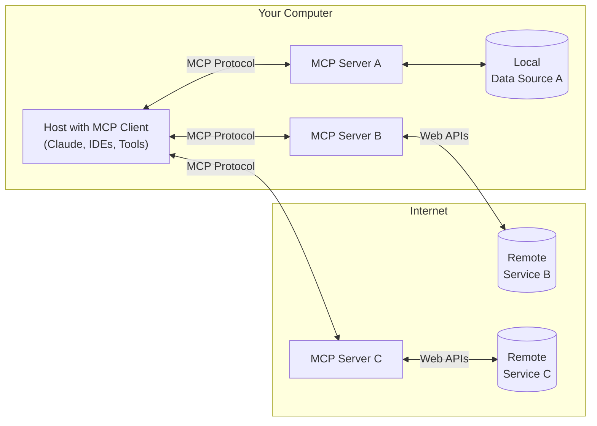

# 🧩 MCPとは何か？

Model Context Protocol（MCP）は、アプリケーションが大規模言語モデル（LLM）に文脈（コンテキスト）を与える方法を標準化するためのオープンプロトコルです。

## 🧷 MCPは、AIアプリケーションにとってのUSB-Cポートのようなものです

ちょうどUSB-Cが、あらゆる周辺機器とデバイスをつなぐ共通の接続口であるように、MCPは、AIモデルとツール・データソース・ワークフローなどを一貫した方法で接続する仕組みを提供します。

## 🚀 MCPの目的

MCPは、LLMをアプリケーションの中核的な知的エージェントとして機能させるために、以下のような **多様な「文脈の提供方法」** を標準化します：

### MCPが提供する3つのコンテキスト手段

| 種類 | 役割 | 例 | 主な制御者 |
|------|------|-----|------------|
| 📄 **Resource** | LLMが読む「外部情報・資料」 | ファイル、ログ、APIレスポンスなど | クライアント（アプリケーション） |
| 💬 **Prompt** | LLMにタスクを指示するテンプレート | コードレビューや要約の型 | ユーザーまたはUI |
| 🛠️ **Tool** | LLMが呼び出せるアクション | 計算処理、外部API、DB操作など | モデル（LLM自身） |

## 🧠 なぜMCPが重要なのか？

LLMを「単なるチャットボット」ではなく、高度な自律エージェントとして活用するには：

- 外部情報（📄Resource）
- 明確なタスク定義（💬Prompt）  
- 実行手段（🛠️Tool）

の3つが必須です。

MCPは、それらを統一的・セキュア・拡張可能な方法で接続できるインターフェースとして機能します。

## 🔗 MCPのアーキテクチャ

MCPは、クライアント-サーバーアーキテクチャを採用しています。

*出典: [MCP公式ドキュメント](https://modelcontextprotocol.io/introduction)*

### 構成要素

| 役割 | 説明 |
|------|------|
| **ホスト（Host）** | Claude DesktopやIDEなど、LLMを内蔵したアプリ。MCPクライアントを含む |
| **クライアント（Client）** | MCPプロトコルを通じてサーバーと通信。ホストの中で動作 |
| **サーバー（Server）** | 外部データや機能をMCP形式で提供する軽量なプログラム群 |

## 🔧 MCPサーバーの特徴

### 軽量で簡単な実装

MCPサーバーは、以下の特徴を持つ軽量なプログラムです：

- **単一目的**: 一つのタスクや統合に特化
- **ステートレス**: 状態を持たず、リクエストに応答するだけ
- **言語非依存**: TypeScript、Python、その他の言語で実装可能

### 研究活動での具体例

研究者向けのMCPサーバーの例：

- **PubMed Server**: 論文検索とメタデータ取得
- **UniProt Server**: タンパク質情報の検索と取得
- **ChEMBL Server**: 化合物データベースへのアクセス
- **ローカルファイルサーバー**: 研究データファイルの読み書き

## 🛠️ MCPサーバー開発のベストプラクティス

Claudeを使ってMCPサーバーを作る際は、以下の点に注意すると良いです：

### 1. **サーバーを小さな機能単位に分割**
- 単一責任の原則に従い、1つのサーバーは1つの明確な目的を持つ
- 例：PubMed検索専用サーバー、UniProt検索専用サーバーなど

### 2. **段階的な開発とテスト**
- 各機能を作るたびに動作テストを実施
- 小さな機能から始めて、徐々に拡張していく

### 3. **セキュリティの実装**
- 入力バリデーションを必ず実装
- アクセス制御を適切に設定
- APIキーなどの機密情報は環境変数で管理

### 4. **保守性の確保**
- 将来の保守のためにコードに十分なコメントを残す
- エラーハンドリングを丁寧に実装
- ログ出力を適切に行う

### 5. **MCP仕様への準拠**
- MCP仕様（型・手順・レスポンス形式など）に忠実に従う
- 公式ドキュメントを常に参照
- 標準的なエラーレスポンスを返す

## ✅ まとめ

MCPは、アプリケーションがLLMに「知識」「指示」「能力」を安全かつ柔軟に渡すための"USB-Cのような統一プロトコル"です。Resource・Prompt・Toolという3つのプリミティブを使って、LLMに文脈を与える手段を標準化します。

研究者にとっては、これまでバラバラだった各種データベースやツールを、統一されたインターフェースで利用できるようになる画期的な仕組みです。

## 📚 さらに詳しく知りたい方へ

- [MCP公式ドキュメント](https://modelcontextprotocol.io/)
- [MCPのGitHubリポジトリ](https://github.com/modelcontextprotocol)
- [MCPサーバーの実装例](https://github.com/modelcontextprotocol/servers)

---

### **関連リンク**:

- [レベル2のトップに戻る](index.md)
- [Claude Desktopのセットアップ](claude-desktop/index.md)